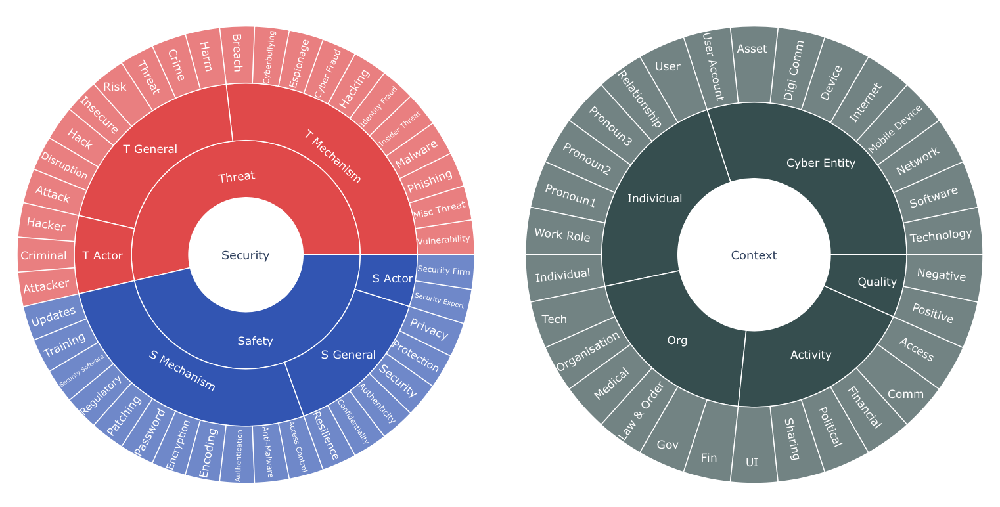

## TACS

Text Analysis tool for the Cyber Security domain (TACS) consists of an open-source dictionary [csd.csv](csd.csv), or codebook, of ca. 700 words and phrases related to cyber security, organised into concepts (e.g., Hacking, Passwords, User) and grouped into overarching categories (e.g., Threat Mechanisms, Security Mechanisms, Cyber Entities), alongside a set of functions [tacs.py](tacs.py) to apply the dictionary codes to textual data and perform numeric transformations and queries.

## Installation

TACS consists of: Dictionary data file `csd.csv` and a python script `tacs.py` with functions to compile and use the dictionary from the Dictionary data.

Running TACS requires [`Python`](https://wiki.python.org/moin/BeginnersGuide/Download) and the libraries [`pandas`](https://pandas.pydata.org/getting_started.html) and [`spacy`](https://spacy.io/usage). Visualisations require `Jupyter Notebook`. With all required packages installed, download the files [tacs.py](tacs.py) and [csd.csv](csd.csv) and run tacs.py in a Python application.

The [Documentation](https://nbviewer.jupyter.org/github/anidroid/tacs/blob/master/Documentation-DRAFT.ipynb) can be accessed as an interactive Jupyter Notebook or HTML.

## Reference

More information about the project can be found in the following [preprint](https://nbviewer.jupyter.org/github/anidroid/tacs/blob/master/tacs-soups.pdf).
